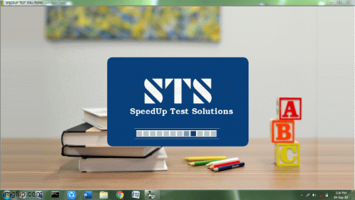
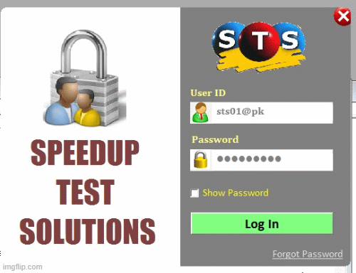
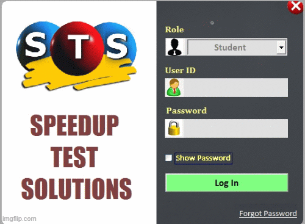

# Speedup Test Solutions

-> Speedup Test Solutions Is a Desktop application for Question Generator and Offline Test Series conductor which conducts tests on various criteria, difficulty level and also generates MCQ question papers on demand.

-> There are different classes and this software has also manages the students record associated with them. It provide various packages for exams like for 1 month, for 2 months, for 6 months, for 12 months on little charge. apart from this it also provide individual tests so any student (not a part of membership) can give test after registration. Registration can be done by both employees and owner.

-> After an individual student give test they are provided the answer key only, but the packages registered student provided not only the answer key but also the Complete analysis of tests which is created on paper either by owner or any of the employees manually which is also time consuming.

-> This application provides different types of MCQ tests 
    	 Subject Based Test (SBT)  (35 Questions)
    	 Topic Based Test (TBT)     (25 Questions)
    	 Full Mock Test (FMT) (Vary but normally 60 Questions)

-> It also Keeps details of income and salary. Admin has full rights to add new subject, topics etc. They also Provide Question papers with proper format on demand.

# SCREEN-SHOTS

## Dashboard

## Admin Panel

## Reports Generated

## Staff Zone

## Student Zone

